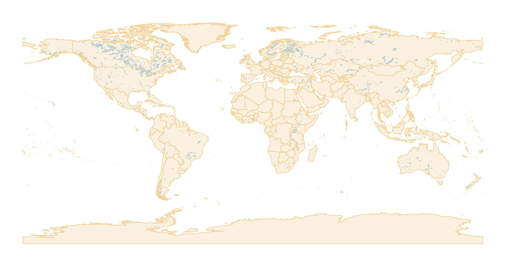

# mappyfile-gdal

[](https://pypi.python.org/pypi/mappyfile-gdal)
[](https://github.com/geographika/mappyfile-gdal/actions/workflows/main.yml)

A [mappyfile](http://mappyfile.readthedocs.io) plugin to create Mapfiles for GDAL datasets.

It takes the JSON output of `gdal raster info` or `gdal vector info` and writes a
[MapServer](https://mapserver.org) Mapfile for it, with a layer per dataset,
a map extent and size matching the data, and default symbology so the result
can be rendered straight away.

## Installation

```console
pip install mappyfile-gdal
```

GDAL 3.11 or later is needed for the `gdal` command line tool, and MapServer to render
the generated Mapfiles. Both are available from conda-forge:

```console
conda create -n gdal-mapserver -c conda-forge gdal mapserver --yes
conda activate gdal-mapserver
pip install mappyfile-gdal
```

## Usage

Pipe `gdal info` output straight into the tool, using `-` to read from stdin:

```console
gdal raster info --stats raster.tif | mappyfile-gdal - raster.map
map2img -m raster.map -o raster.png
```

Without an output path the Mapfile is printed to stdout:

```console
gdal vector info poly.gpkg | mappyfile-gdal
```

Or use a saved JSON file, or a whole folder of them:

```console
gdal raster info --stats raster.tif --of json > raster.json
mappyfile-gdal raster.json raster.map

mappyfile-gdal ./json ./mapfiles
```

## Example

Two layers from the [Natural Earth](https://www.naturalearthdata.com/) GeoPackage,
piped through to a rendered image:

```console
gdal info natural_earth_vector.gpkg --of JSON --layer ne_10m_lakes --layer ne_10m_admin_0_countries | mappyfile-gdal - out.map
map2img -m out.map -o out.png
```



The generated Mapfile is [out.map](out.map).

### Options

| Option | Description |
| --- | --- |
| `--shapepath PATH` | Sets `SHAPEPATH`, so relative `DATA` and `CONNECTION` paths resolve |
| `--version` | Print the version and exit |
| `-h`, `--help` | Print usage and exit |
| `-v`, `--verbose` | Show debug messages |
| `-q`, `--quiet` | Only show errors |

`gdal info` reports paths exactly as they were given to it, so a dataset opened with a
relative path produces a Mapfile with a relative `DATA`. MapServer resolves those
against `SHAPEPATH`, or against the Mapfile's own folder when `SHAPEPATH` isn't set:

```console
gdal raster info --stats aaigrid/byte.asc | mappyfile-gdal - byte.map --shapepath /data/gdal
```

### Statistics

Passing `--stats` to `gdal raster info` allows minimum and maximum to be
written as `PROCESSING "SCALE=min,max"`, which stretches the
values to the full range of greys. Without it MapServer scales each request from the
pixels it happens to be drawing, so the same value appears as different shades at
different zoom levels.

### Selecting layers

For a dataset with many layers, such as a GeoPackage, every layer is added to the
Mapfile. To get a Mapfile for a single layer, select it in GDAL using the `--layer` option:

```console
gdal vector info --layer roads data.gpkg | mappyfile-gdal - roads.map
```

## Python API

```python
import json

from mappyfile_gdal.main import main

with open("example.json", encoding="utf-8") as f:
    data = json.load(f)

# save the Mapfile and return its path
main(data, "example.map", shapepath="/data/gdal")

# or return the Mapfile as a string
mapfile = main(data)
```

## What gets generated

- **Rasters** become a `TYPE RASTER` layer, with `PROCESSING "SCALE"` and `"NODATA"`
  when statistics are available.
- **Vectors** use `CONNECTIONTYPE OGR` with one layer per geometry layer, polygons are drawn
  first and points last, each in its own colour with semi-transparent fills so overlapping layers stay visible.
- **WMS capabilities documents** use `CONNECTIONTYPE WMS` with one layer per subdataset.
- **`EXTENT`** is inset by half a pixel, since MapServer measures it between the centers
  of the corner pixels while GDAL reports the outer edges.
- **`PROJECTION`** is set when the dataset's CRS has an authority code. Datasets without
  one are drawn in their native coordinates.

## Development

```console
git clone https://github.com/geographika/mappyfile-gdal.git
cd mappyfile-gdal
pip install -e .
pip install -r requirements-dev.txt

pytest
flake8 .
mypy mappyfile_gdal
```

## License

MIT